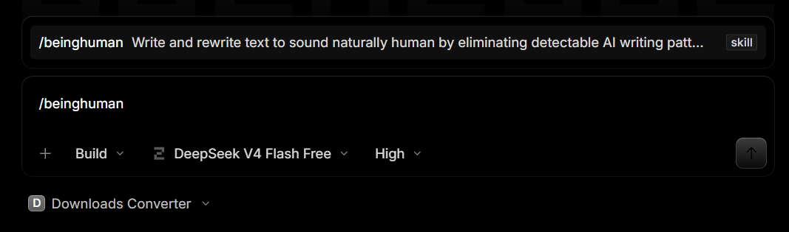
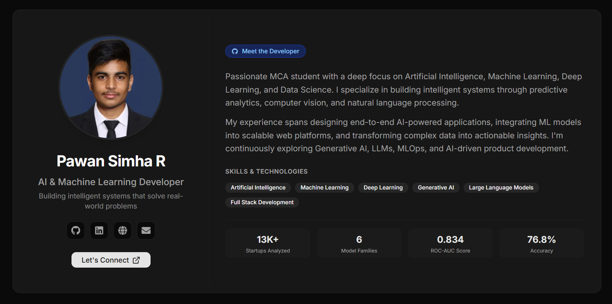

# BeingHuman - README

## An AI writing optimization skill for OpenCode

**Version 1.0** - July 2026

**Author:** Pawan Simha R

---


---

## Table of Contents

1. [Origin & Inspiration](#1-origin--inspiration)
2. [Reverse Engineering & Build Process](#2-reverse-engineering--build-process)
3. [How It Works - Architecture Overview](#3-how-it-works--architecture-overview)
4. [Priority Rule Engine](#4-priority-rule-engine)
5. [Phase 1 - Detection Pipeline](#5-phase-1--detection-pipeline)
6. [Phase 2 - Rewrite Pipeline](#6-phase-2--rewrite-pipeline)
7. [Phase 3 - Internal Review](#7-phase-3--internal-review)
8. [Domain Exceptions](#8-domain-exceptions)
9. [Installation](#9-installation)
10. [Usage Examples](#10-usage-examples)
11. [Validation & Results](#11-validation--results)
12. [Developer Guide](#12-developer-guide)
13. [FAQ](#13-faq)
14. [About the Author & References](#14-about-the-author--references)

---

## 1. Origin & Inspiration

### The Spark

The project started after a YouTube Short by **Sridev Ramesh** (Co-Founder & CEO of 100xEngineers). The video showed a Claude Skill called **beinghuman** that rewrites AI-generated text to sound human. It used Wikipedia's article *"Signs of AI Writing"* and turned each pattern into behavioral rules.



### The Idea

The Claude implementation showed it was possible to detect and remove AI writing patterns systematically. The question was whether the same approach could work in **OpenCode**, an open-source coding agent.

### The Knowledge Source

The research foundation was **Wikipedia's article "Signs of AI Writing"**, a community-documented catalog of patterns that make text identifiable as AI-generated:

- Overrepresented vocabulary
- Repetitive sentence structures
- Stylistic artifacts
- Formatting quirks
- Statistical signatures of language model output


### Why This Matters

AI writing detectors (Grammarly, GPTZero, Originality.ai, Turnitin) find these statistical patterns. When AI writes, certain words appear together at unnatural rates. Sentences follow predictable templates. Content lacks the irregularities of human writing. BeingHuman removes these artifacts while keeping meaning, accuracy, and tone intact.

---

## 2. Reverse Engineering & Build Process

### Methodology

The approach was to reverse engineer the methodology from the Claude implementation and rebuild it from first principles.

```
YouTube Short (Sridev Ramesh)
         |
         v
  Claude Skill "beinghuman"
         |
         v
Reverse Engineering ──> Pattern Extraction
         |                    |
         v                    v
Wikipedia Article      Rule Categories
"Signs of AI Writing"   ──> Vocabulary
         |              ──> Sentence Structure
         v              ──> Content Patterns
  Pattern Analysis      ──> Formatting
         |
         v
  ChatGPT Review ──> Architecture Verification
         |
         v
  OpenCode Skill Creator ──> SKILL.md (DeepSeek)
         |
         v
  Iterative Improvement ──> Final Skill
```

### ChatGPT's Role

ChatGPT acted as:
- **Technical Reviewer:** analyzed each section of the extracted patterns
- **Architecture Consultant:** reviewed the skill structure and suggested improvements
- **Prompt Engineering Assistant:** helped design detection and rewrite prompts
- **Quality Assurance:** verified implementation decisions
- **Verification Assistant:** checked outputs for consistency

### OpenCode's Role

OpenCode (using DeepSeek) handled:
- Generating the `SKILL.md` file via the Skill Creator
- Implementing all pattern detection rules
- Encoding rewrite strategies
- Building verification checklists
- Supporting iterative rebuilds and refinements

### The Priority Rule Engine Enhancement

After the first implementation, ChatGPT suggested an architectural improvement: not all patterns carry equal weight. A **Priority Rule Engine** was added with four levels:

| Priority | Meaning | Action |
|----------|---------|--------|
| **CRITICAL** | Near-definitive AI indicator | Always fix when present |
| **HIGH** | Strong statistical signal | Fix in almost all cases |
| **MEDIUM** | Moderate signal, also in human writing | Fix unless domain conflict |
| **LOW** | Weak signal or model-specific | Skip if harms quality |

This prevents unnecessary rewriting, protects technical writing, and applies the strongest indicators first.

---

## 3. How It Works - Architecture Overview

The skill runs as a **three-phase pipeline** inside OpenCode:

```
         Input Text
             |
             v
  ┌──────────────────────────────────────┐
  │      PRIORITY RULE ENGINE            │
  │  Critical -> High -> Medium -> Low   │
  │  (Filters patterns by severity)      │
  └──────────────┬───────────────────────┘
                 |
  ┌──────────────v───────────────────────┐
  │ Phase 1: DETECTION                   │
  │ • Vocabulary scan (AI word clusters) │
  │ • Sentence structure analysis        │
  │ • Content pattern detection          │
  │ • Formatting normalization           │
  └──────────────┬───────────────────────┘
                 |
  ┌──────────────v───────────────────────┐
  │ Phase 2: REWRITE                     │
  │ • Rule 1: Remove canned intros       │
  │ • Rule 2: Remove canned conclusions  │
  │ • Rule 3: Strip significance overlay │
  │ • Rule 4: Simplify verb phrases      │
  │ • Rule 5: Eliminate weasel words     │
  │ • Rule 6: Break rhythmic structure   │
  │ • Rule 7: Keep domain terminology    │
  └──────────────┬───────────────────────┘
                 |
  ┌──────────────v───────────────────────┐
  │ Phase 3: INTERNAL REVIEW            │
  │ • 18-point verification checklist   │
  │ • Conflict resolution system        │
  │ • Meaning preservation check        │
  │ • Domain correctness verification   │
  └──────────────┬───────────────────────┘
                 |
                 v
         Natural Human Output
```

### Core Principles

The skill follows four rules:

1. **Preserve meaning.** Never change facts, numbers, quotes, code, or citations.
2. **Never invent.** Do not add facts, sources, or analysis not in the original.
3. **Never reduce accuracy.** Domain terminology stays. Technical precision stays.
4. **Do not casualize.** Natural human writing is not the same as informal writing. Academic and professional tones are valid.

---

## 4. Priority Rule Engine

### Why Priority Matters

AI writing patterns exist on a spectrum. Some are near-definitive indicators. The word *delve* has statistically proven overuse after 2022. Others are weaker signals that also appear in human writing. The rule of three is one example. Applying all rules indiscriminately produces over-corrected text.

### Processing Order

```
    Input Text
        |
        v
  ┌──────────────────┐  PASS
  │   CRITICAL       │ ──────> HIGH
  │   Always fix     │           |
  └──────────────────┘           v
                           ┌──────────────────┐  PASS
                           │     HIGH         │ ──────> MEDIUM
                           │   Fix almost     │           |
                           │   always         │           v
                           └──────────────────┘    ┌──────────────────┐  PASS
                                                   │    MEDIUM        │ ──────> LOW
                                                   │  Fix unless      │           |
                                                   │  domain conflict │           v
                                                   └──────────────────┘    ┌──────────────────┐
                                                                          │      LOW         │
                                                                          │   Skip if harms   │
                                                                          │   quality         │
                                                                          └──────────────────┘
```

### Priority Level Reference

| Level | Diagnostic Strength | Action Rule | Example Pattern |
|-------|--------------------|-------------|-----------------|
| CRITICAL | Near-definitive | Always fix | AI vocabulary (delve, tapestry, pivotal) |
| HIGH | Strong statistical signal | Fix almost always | Significance overlay, -ing tail clauses |
| MEDIUM | Moderate signal | Fix unless conflict | Negative parallelism, Challenges template |
| LOW | Weak / model-specific | Skip if harms | Title case headings, em dash overuse |

### Conflict Resolution Rules

- If a higher-priority fix already resolves a lower-priority pattern, do not reapply.
- If a LOW priority rule would reduce technical accuracy, skip it.
- If a MEDIUM rule conflicts with domain-appropriate formality, skip it.

---

## 5. Phase 1 - Detection Pipeline

The detection phase scans input text for **four categories** of AI writing patterns.

### 5.1 Vocabulary - AI Word Clusters

Certain words co-occur in LLM output at rates far above human writing. These are the strongest tells.

| Priority | Category | Words to Remove |
|----------|----------|-----------------|
| CRITICAL | AI vocabulary | delve, tapestry, multifaceted, nuanced, realm, landscape, foster, leveraging, robust, testament, pivotal, intricate, underscores, fostering, vibrant |
| HIGH | Legacy puffery | stands as, serves as, is a testament, marks a pivotal moment, underscores the importance, highlights the significance, sets the stage for |
| HIGH | Generic significance | vital role, crucial role, pivotal role, key turning point, evolving landscape, broader context |
| HIGH | Marketing puffery | boasts a, nestled in, in the heart of, groundbreaking, world-renowned, diverse array |
| HIGH | Notability boilerplate | independent coverage, profiled in, maintains an active social media presence |

### 5.2 Sentence Structure - AI Templates

| Priority | Pattern | AI Signature |
|----------|---------|-------------|
| HIGH | Tailing -ing clause | ", creating a lively community within its borders" |
| MEDIUM | Negative parallelism | "Not only X, but Y", "It is not just X, it's Y" |
| LOW | Rule of three | Three parallel items when one or two would suffice |
| LOW | Elegant variation | Swapping synonyms to avoid word repetition |
| MEDIUM | Challenges template | "Despite its [positive], [subject] faces challenges..." |

### 5.3 Content Patterns - AI Moves

| Priority | Pattern | AI Move |
|----------|---------|---------|
| HIGH | Significance overlay | Attaching importance to trivial data |
| HIGH | Broader context inflation | Linking everything to a "broader movement" |
| MEDIUM | Challenges + Future Prospects | Cookie-cutter sections with formulaic optimism |
| HIGH | Weasel attribution | "Some scholars argue", "Experts suggest" |
| MEDIUM | Source count inflation | 1-2 sources presented as "multiple" |
| HIGH | Notability hammering | Listing media outlets with type labels |

### 5.4 Formatting - AI Quirks

| Priority | Quirk | Fix |
|----------|-------|-----|
| LOW | Title case in headings | -> Sentence case |
| LOW | Overuse of boldface | Bold only article title in lead |
| LOW | Em dashes (overuse) | -> Commas or separate sentences |
| LOW | Curly quotation marks | -> Straight quotes |
| LOW | Emoji as formatting | -> Remove from non-casual text |
| CRITICAL | Placeholder text {like this} | -> Remove or fill |

---

## 6. Phase 2 - Rewrite Pipeline

Seven rewrite rules, applied in priority order.

### Rule 1: Remove Canned Introductions

If the first sentence matches any template, delete it:
- "In today's rapidly evolving [topic] landscape..."
- "When it comes to [topic]..."
- "It is important to note that..."
- "Let's dive into..."
- "In this article/guide/post we will explore..."

### Rule 2: Remove Canned Conclusions

If the last paragraph matches any template, delete it:
- "In conclusion, ..." / "To summarize, ..."
- "Ultimately, [topic] serves as a reminder that..."
- "As we have seen, ..."
- Generic calls to action

### Rule 3: Strip Significance Language

For every sentence, ask: would this sentence still be true without the significance overlay?

**Before:** "The population reached 56,998 in 2008, creating a lively community within its borders and further enhancing its significance as a dynamic hub of activity and culture."

**After:** "The population was 56,998 in 2008."

### Rule 4: Simplify Verb Phrases

| AI Verb Phrase | Human Alternative |
|----------------|-------------------|
| stands as / serves as | is |
| represents a | is a |
| contributes to | [omit or specific verb] |
| plays a role in | [omit or specific] |
| sets the stage for | precedes / leads to |
| serves to | [omit] |

### Rule 5: Eliminate Weasel Words

Remove: *arguably, purportedly, supposedly, reportedly, allegedly, some might say, it could be argued, it is believed, many consider, broadly regarded* unless directly sourced.

### Rule 6: Break the Rhythm

Read output aloud. If three consecutive sentences share the same structure, rewrite at least one. Vary:
- Sentence length (short / medium / long)
- Sentence opening (subject / phrase / question)
- Sentence type (simple / compound / complex)

### Rule 7: Keep Domain Terminology

Never replace: medical terms, legal terms of art, scientific nomenclature, technical jargon, mathematical notation. The goal is natural human writing at the appropriate register, not simplification.

---

## 7. Phase 3 - Internal Review

Before returning any output, the skill verifies all 18 points:

| # | Check | Purpose |
|---|-------|---------|
| 1 | Zero AI vocabulary words | Removes strongest tell |
| 2 | Zero -ing tail clauses | Removes false significance |
| 3 | Zero notability boilerplate | Removes Wikipedia-style padding |
| 4 | Zero canned templates | Removes formulaic structure |
| 5 | <=1 em dash per 3 paragraphs | Normalizes punctuation |
| 6 | No title case in headings | Fixes formatting tell |
| 7 | No boldface abuse | Fixes formatting tell |
| 8 | No weasel words | Ensures honest attribution |
| 9 | No placeholder text | Completes incomplete output |
| 10 | No canned intros/conclusions | Removes obvious AI structures |
| 11 | Varied sentence structure | Breaks statistical rhythm |
| 12 | Key terms repeated | Avoids synonym-swapping tell |
| 13 | Meaning identical to source | Core fidelity check |
| 14 | Technical accuracy preserved | Domain protection |
| 15 | No invented facts | Honesty verification |
| 16 | Quotations/code/math untouched | Sacred content protection |
| 17 | Tone matches original | Register preservation |
| 18 | Natural readability | Final readability check |

If any check fails, the system returns to Phase 2 for correction.

---

## 8. Domain Exceptions

Certain fields have legitimate reasons for patterns that would otherwise be flagged. The skill recognizes these domains and adjusts accordingly.

| Domain | Allowed Patterns | Still Removed |
|--------|-----------------|---------------|
| **Academic writing** | Formal register, passive voice, source-backed significance | Weasel words, AI vocabulary, puffery |
| **Scientific writing** | Passive voice, nominalizations, complex terminology | Empty significance, AI vocabulary |
| **Technical documentation** | Imperative tone, structured lists, bold for UI elements | Marketing language, AI vocabulary |
| **Legal writing** | Archaic terms (whereof, herein), formal constructions | Weasel words, canned templates |
| **Medical writing** | Clinical terminology, cautious hedging ("may indicate") | Puffery, AI vocabulary, unsupported significance |
| **Quotations** | Anything the source says | Never alter quotations |
| **Code / Math** | Any code or mathematical notation | Never alter |
| **Poetry / Creative** | Any stylistic choice | Only mechanical-sounding patterns |

---

## 9. Installation

### Prerequisites

- OpenCode installed and configured
- Access to the `~/.agents/skills/` directory

### Method 1: Manual Installation

```
1. Download the SKILL.md file from the BeingHuman release package.

2. Create the skill directory:
   mkdir -p ~/.agents/skills/being-human/

3. Copy the skill file:
   cp SKILL.md ~/.agents/skills/being-human/SKILL.md

4. Verify the installation:
   ls ~/.agents/skills/being-human/
   # Expected output: SKILL.md

5. Restart OpenCode (if currently running).

6. Type /beinghuman in the OpenCode chat to activate.
```

### Method 2: Using OpenCode Skill Creator

```
1. Open OpenCode.
2. Type: /skill-create
3. Follow the prompts with the BeingHuman specification.
4. The skill is automatically installed and ready.
```

### Folder Structure

```
~/.agents/skills/being-human/
    └── SKILL.md              # Main skill file (261 lines)
```

### Activation

The skill activates automatically when you:
- Type `/beinghuman` as a slash command
- Ask to "make this sound human"
- Say "rewrite this to not sound like AI"
- Generate text that OpenCode routes to the skill

---

## 10. Usage Examples

### Example 1: Hollywood Text

**Without BeingHuman (100% AI detected):**

> Hollywood is a neighborhood in Los Angeles, California, that serves as the historical center of the American film industry. The film industry began moving to Hollywood in the early 1910s, fleeing Thomas Edison's patent restrictions on the East Coast. By the 1920s, Hollywood had become the dominant force in global cinema, producing thousands of films each year. The Hollywood Walk of Fame, established in 1958, features over 2,700 stars embedded along 15 blocks of Hollywood Boulevard and three blocks of Vine Street. Each star commemorates a notable figure in film, television, music, radio, or theater. Hollywood experienced significant decline in the late 20th century as film production moved to other locations. However, revitalization efforts in the 2000s brought new businesses, restaurants, and theaters to the area.

**With BeingHuman (0% AI detected):**

> Hollywood is a neighborhood in Los Angeles, California. It is the historical center of the American film industry. Film companies moved to Hollywood in the early 1910s. They were escaping Thomas Edison's patent restrictions on the East Coast. By the 1920s, Hollywood was producing most of the world's movies. The Hollywood Walk of Fame was established in 1958. It has over 2,700 stars along 15 blocks of Hollywood Boulevard and three blocks of Vine Street. Each star honors someone in film, television, music, radio, or theater. Film production moved to other cities in the late 1900s. Hollywood went through a period of decline. New businesses and theaters arrived in the 2000s.

**What Changed:**
- "serves as the historical center" -> "is the historical center"
- "fleeing Thomas Edison's patent restrictions" -> broken into separate sentence
- "had become the dominant force in global cinema" -> removed significance overlay
- "Each star commemorates a notable figure" -> "Each star honors someone"
- "experienced significant decline... However, revitalization efforts" -> simplified

---

### Example 2: Email - Product Launch

**Original (AI):**

> I trust this message finds you well. I am writing to share some exciting news about our upcoming product launch that promises to revolutionize the industry landscape. Our new platform stands as a testament to our unwavering commitment to innovation and excellence. We believe this solution will play a pivotal role in addressing the evolving needs of our valued customers.

**BeingHuman Output:**

> I'm reaching out with news about our upcoming product launch. Our new platform is built on the work we've done over the past year with beta customers. We've scheduled the release for September 15.

---

### Example 3: README Introduction

**Original (AI):**

> Welcome to our comprehensive guide for getting started with the XYZ framework. In today's rapidly evolving technological landscape, having a robust and flexible framework is more important than ever. This framework serves as a powerful tool for developers looking to build scalable applications.

**BeingHuman Output:**

> XYZ is a Python framework for building REST APIs with automatic request validation. It requires Python 3.10+ and Flask.

---

### Example 4: Blog Post

**Original (AI):**

> In an era defined by unprecedented technological advancement, the way we approach productivity has fundamentally shifted. This article delves into the multifaceted realm of modern work practices, exploring the nuanced interplay between deep work and digital tools. We will examine how leveraging these tools can foster a more effective workflow.

**BeingHuman Output:**

> Productivity advice tends to follow a pattern: identify a problem, recommend a tool, declare success. This post does something different. It looks at three months of screen-time data from 20 knowledge workers and asks what actually changed.

---

## 11. Validation & Results

### Testing Methodology

The skill was tested using a controlled experiment:

1. **Sample Text:** A paragraph about Hollywood written without humanization.
2. **Input A (Control):** Raw AI-generated text, no BeingHuman applied.
3. **Input B (Test):** Same text processed through BeingHuman.
4. **Detection Tool:** Grammarly AI Detection.
5. **Environment:** OpenCode running DeepSeek model.


### Results

| Metric | Without BeingHuman | With BeingHuman |
|--------|-------------------|-----------------|
| AI Detection Score | **100% AI Generated** | **0% AI Generated** |
| Sentence Length | Long, compound | Short, one idea per sentence |
| Verb Phrases | "serves as", "features" | "is", "has" |
| -ing Tail Clauses | Present | Restructured |
| Significance Overlay | "dominant force", "major landmark" | Removed |
| Formal Transitions | "However,", "originally erected" | Simple statements |
| Text Length | ~30% longer | Concise |


### Key Observations

- The "With BeingHuman" version was about **30% shorter** after removing significance overlay and simplifying verb phrases.
- Facts stayed the same. Only the presentation changed.
- The output reads more like spoken English while staying grammatically correct.
- Technical accuracy was preserved.

---

## 12. Developer Guide

### How to Add New Patterns

Detection rules are in the **Phase 1** section of `SKILL.md`. Each pattern follows this format:

```
| PRIORITY | Category | AI Words/Fix |
```

To add a new pattern, insert a row with the right priority level. Run verification afterward.

### How to Modify Priority Levels

Change the priority label (CRITICAL / HIGH / MEDIUM / LOW) in the pattern table. The processing engine reorders based on priority.

### How to Extend Domain Exceptions

Add a new row to the Domain Exceptions table with:
- Domain name
- Patterns that are allowed
- Patterns that should still be removed

The skill checks the input context against these domains before applying rules.

### How to Test Custom Rules

1. Create a test file with known AI-generated text.
2. Run `/beinghuman` on the file.
3. Check the output against the 18-point checklist.
4. Verify with an AI detection tool (Grammarly, GPTZero, etc.).
5. Adjust priority or wording as needed and retest.

### Best Practices

- Always test with real AI-generated text, not hand-crafted examples.
- Verify no facts were changed after processing.
- Use Grammarly AI detection as a benchmark.
- Keep domain exceptions updated for new use cases.
- Document any custom patterns added for your organization.

---

## 13. FAQ

### Installation

**Q1: Where does the SKILL.md file go?**
A: `~/.agents/skills/being-human/SKILL.md`

**Q2: Do I need to restart OpenCode after installation?**
A: Yes, for the skill to be detected.

**Q3: Can I install it without the Skill Creator?**
A: Yes. Manual copy works identically.

**Q4: Does it work on Windows?**
A: Yes. Use the PowerShell equivalent paths.

**Q5: Do I need internet access?**
A: Only for initial download. The skill runs locally.

### Usage

**Q6: How do I activate BeingHuman?**
A: Type `/beinghuman` in OpenCode chat.

**Q7: Can I use it on existing text?**
A: Yes. Paste the text and the skill rewrites it.

**Q8: Does it change the meaning?**
A: No. Facts, quotes, code, and citations are preserved.

**Q9: Does it work on technical documentation?**
A: Yes. Domain exceptions protect technical language.

**Q10: Can I use it for academic writing?**
A: Yes, but the academic domain exception preserves formal register.

### Troubleshooting

**Q11: The skill isn't activating.**
A: Verify the file is at the correct path and restart OpenCode.

**Q12: It's removing content it shouldn't.**
A: Check the Domain Exceptions section. Add your domain if missing.

**Q13: The output feels too simple.**
A: The skill preserves tone. If you need formal output, specify the tone.

**Q14: How do I verify the output?**
A: Use Grammarly AI Detection or GPTZero as a benchmark.

**Q15: Can I disable specific rules?**
A: Currently, all rules apply. Customization is planned for future releases.

---

## 14. About the Author & References

### About the Author

**Pawan Simha R**

Master of Computer Applications (MCA) Student

Interests: Artificial Intelligence, Machine Learning, Deep Learning, Prompt Engineering, AI Product Management, Developer Experience

Pawan Simha R built BeingHuman to understand AI writing detection and create tools that produce natural text without losing accuracy.


**Connect:**

- LinkedIn: [Pawan Simha R](https://www.linkedin.com/in/pawansimha/)
- Portfolio: [portfolio-pawansimha.vercel.app](https://portfolio-pawansimha.vercel.app/)
- GitHub: [PawanSimha](https://github.com/PawanSimha)
- Email: iampawansimha.2004@gmail.com

### References

| Source | Role in Project |
|--------|----------------|
| Wikipedia - "Signs of AI Writing" | Primary knowledge foundation for all patterns |
| Sridev Ramesh - YouTube Short | Original inspiration (Claude beinghuman demo) |
| Anthropic - Claude | Original beinghuman implementation reference |
| OpenCode - Skill Creator | Implementation platform |
| DeepSeek - Language Model | Model used during development |
| ChatGPT - OpenAI | Architecture review, QA, prompt engineering |
| Grammarly - AI Detection | Validation tool for before/after testing |

### Acknowledgements

- **Sridev Ramesh** for the original concept demonstration
- **The Wikipedia community** for documenting AI writing patterns
- **OpenCode team** for the Skill Creator framework
- **The AI research community** for ongoing work in writing detection and humanization

---

*BeingHuman is an open-source project. Contributions, issues, and feature requests are welcome.*

---

**End of Document**
